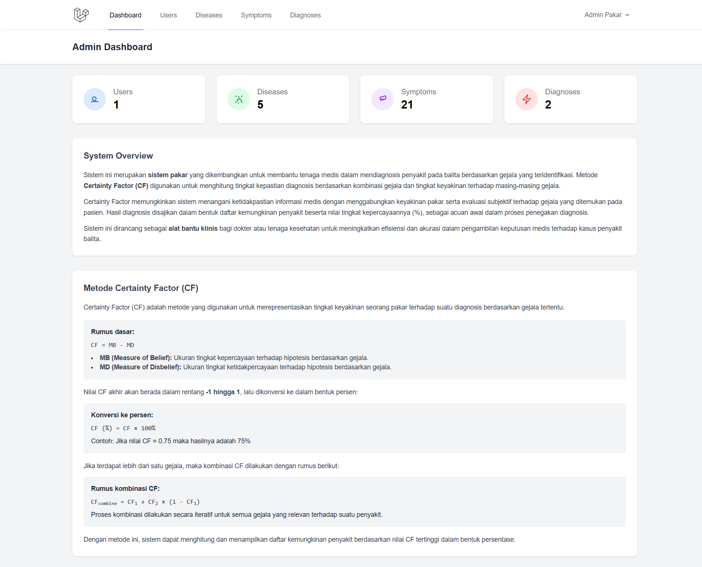

# Toddler Health Expert System



A web-based expert system designed to assist in the preliminary diagnosis of common health issues in toddlers. Users can input observed symptoms, and the system will provide a potential diagnosis based on a predefined knowledge base of diseases and their corresponding symptoms. The application is built with the Laravel framework.

## Features

-   **User Authentication:** Secure registration and login for users.
-   **Symptom-Based Diagnosis:** Interactive checklist of symptoms to determine potential health issues.
-   **Admin Dashboard:** A dedicated panel for administrators to manage the application's data.
-   **Knowledge Base Management:** Admins can perform CRUD (Create, Read, Update, Delete) operations on diseases and symptoms.
-   **User Management:** Admins can manage user accounts.
-   **Diagnosis History:** View past diagnosis results.

## Tech Stack

-   [Laravel](https://laravel.com/)
-   [PHP](https://www.php.net/)
-   [SQLite](https://www.sqlite.org/) / [MySQL](https://www.mysql.com/)
-   [Tailwind CSS](https://tailwindcss.com/)
-   [Vite](https://vitejs.dev/)

## Installation Guide

Follow these steps to get the project up and running on your local machine.

1.  **Clone the repository:**

    ```bash
    git clone https://github.com/kucingscript/sistem-pakar-balita.git
    ```

2.  **Navigate to the project directory:**

    ```bash
    cd sistempakar-balita
    ```

3.  **Install Composer dependencies:**

    ```bash
    composer install
    ```

4.  **Install NPM dependencies:**

    ```bash
    npm install
    ```

5.  **Create your environment file:**
    Copy the example environment file and generate your application key.

    ```bash
    cp .env.example .env
    ```

6.  **Generate an application key:**

    ```bash
    php artisan key:generate
    ```

7.  **Configure your database:**
    Open the `.env` file and set your database connection details (e.g., `DB_DATABASE`, `DB_USERNAME`, `DB_PASSWORD`).

8.  **Run database migrations and seeders:**
    This will create the necessary tables and populate them with initial data.

    ```bash
    php artisan migrate --seed
    ```

9.  **Build front-end assets:**

    ```bash
    npm run dev
    ```

10. **Start the development server:**
    ```bash
    php artisan serve
    ```
    The application will be available at `http://127.0.0.1:8000`.

## Usage

After installation, you can access the application in your web browser.

### Default Admin Account

The database seeder creates a default admin user with the following credentials:

-   **Email:** `admin@admin.com`
-   **Password:** `admin123`
